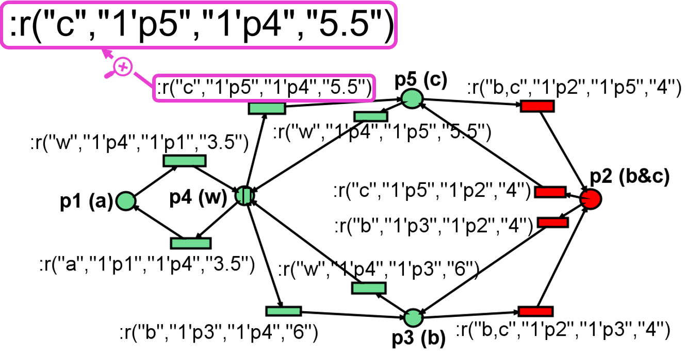
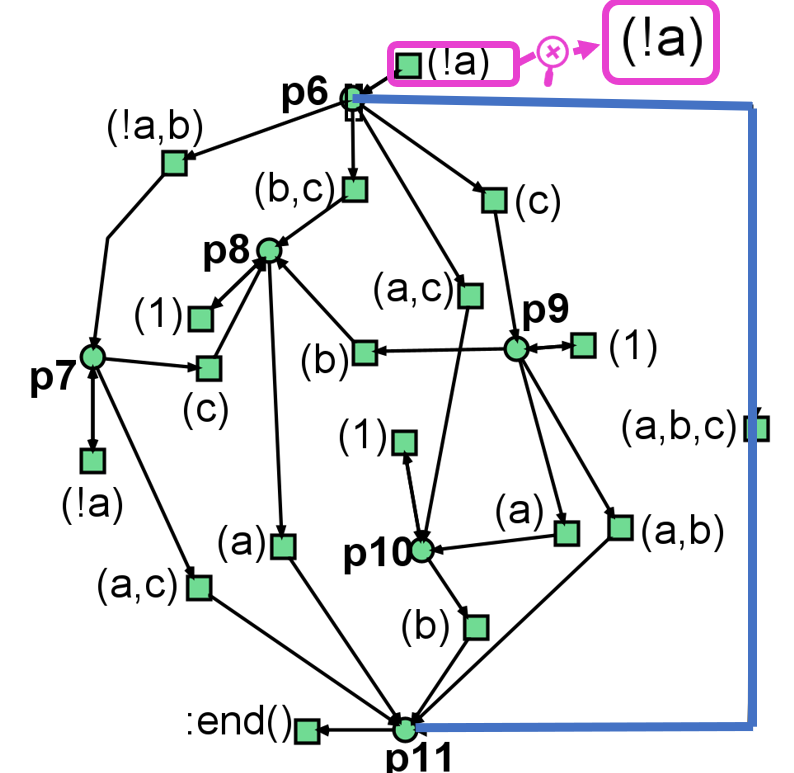
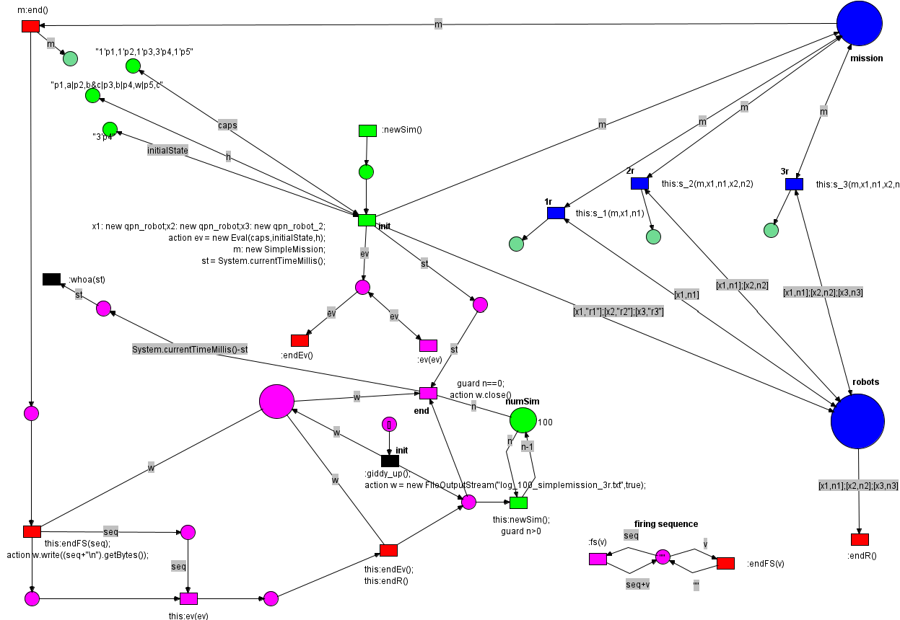
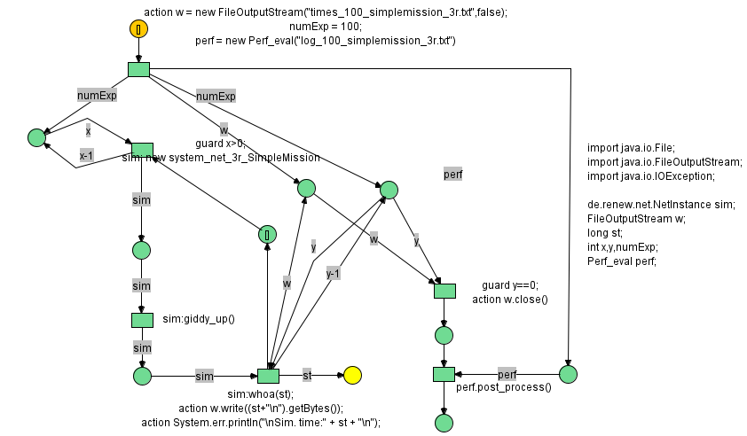

# Example in Renew

**Renew Models for RobotOPN and SpecOPN**

Let us recall the formal notation of the sets of regions of interest  
$\mathcal{Y} = \{y_1, y_2, \dots y_{|Y|}\}$, respectively of atomic propositions  
$\mathcal{B} = \{b_1, b_2, \dots b_{|B|}\}$.  

For a simpler visualization in the Renew simulator, the notations are redefined to eliminate the subscripts. For example, the formal notation of atomic propositions $\mathcal{B}$ for the set of regions  
$\mathcal{Y} = \{y_1,y_2,y_3,y_4\}$ (Figure 1) is replaced by the set $\{a,b,c,w\}$ in exactly this order, with $w$ assigned to the free space $y_4$.  

Additionally, the symbols $\neg$ and $\wedge$ are replaced in Renew with the syntax `!` and `,`, respectively. The **True** value returned by the associated Büchi automaton of the co-safe LTL formula is represented in the tool by `1`.

---

**Figure 1.** Examples of the RobotOPN models in Renew: Robots $r_1$ `qpn_robot` and $r_2$ `qpn_robot_2` are free to move throughout the workspace. Robot $r_3$ is prohibited from entering the overlapping area between $y_2$ and $y_3$ (excluding the red places and transitions).  

---

Firstly, Figure 1 portrays the design of a $RobotOPN$ representation, considering the environment described in Figure 1. Specifically, the workspace contains a set of 3 regions of interest, two of them being overlapped $y_2 \wedge y_3$.  

- Robots $r_1$ and $r_2$ move freely.  
- Robot $r_3$ is not allowed to enter the overlapped region.  

Thus, the place $p_2$ modeling the overlaid area together with the input and output transitions are highlighted in red. In other words, the $RobotOPN$ model for $r_3$ includes only the places and transitions colored in green, while $r_1$ and $r_2$ are associated with a Petri net modeled by all the places and transitions illustrated in the figure.  

Each transition is labeled (magenta color). For instance, the label `(c,1'p5,1'p4, ...)` corresponds to the information required for synchronization, used by the *GEF*:  

- The robot occupies one unit in the region labeled with $c$ (modeled by $p5$).  
- It frees its position from the free space $w$ (modeled by $p4$).  

Thus, the atomic proposition for $c$ is evaluated as **True**. The last parameter in the label represents additional robot information, e.g., the movement time. In this example, the robot needs `5.5` time units to move from $p4$ to $p5$, assuming constant velocity.  

---

**Remark.** In the implementation, there are two Renew models for these two types of robots:  

- Since $r_1$ and $r_2$ have the same spatial constraints, a single RobotOPN model is sufficient, including all 5 places.  
- For $r_3$, the RobotOPN model includes only 4 places, excluding the overlapped region modeled by $p2$.  

---

**Figure 2.** Renew SpecOPN model for the LTL formula  
$\varphi= \diamondsuit b_1 \wedge \diamondsuit b_2 \wedge \diamondsuit b_3 \wedge  \left(\neg b_1~\mathcal{U}~b_3\right)$.  

---

Figure 2 illustrates the SpecOPN model in Renew, associated with the mission  
$\varphi= \diamondsuit b_1 \wedge \diamondsuit b_2 \wedge \diamondsuit b_3 \wedge  \left(\neg b_1~\mathcal{U}~b_3\right)$.  

- Transition labels (magenta) indicate atomic propositions.  
- For example, `(!a)` expresses the negation of atomic proposition $b_1$ associated with region $y_1$.  
- The blue color shows the run returned by Renew after 100 simulations, representing the shortest path of the robotic team.  

The place `:end()` models the final state: a token in place $p11$ means the mission is achieved.  

---

**Figure 3.** Example of the High-Level robotic team Petri net model in Renew.  

---

Figure 3 portrays the main file representing the *High-Level robotic team Petri net* framework under the Nets-within-Nets paradigm.  

- The **blue** places show the system net:  
  - `mission` contains as a token the $SpecOPN$ model.  
  - `robots` contains three tokens referencing the $RobotOPN$ models.  
- Blue transitions are added for each robot.  
- Other colors:  
  - Green = simulation inputs (max capacity, atomic proposition mapping, initial positions).  
  - Red = finalizing simulation.  
  - Pink = process results (shortest path, run time).  

For instance, on the top left, three green places define:  
1. Maximum capacity per place (e.g., 3 robots in free space $w$).  
2. Association between places and atomic propositions (e.g., $p_4$ models $w$).  
3. Initial robot positions (all robots starting in free space).  

---

**Figure 4.** Example of the `execute_experiment` net in Renew.  

---

To run the simulations, another net is modeled in Renew, called **`execute_experiment`**. This net encapsulates data about the simulation:  

- Number of simulations per experiment.  
- Names of the `.txt` files storing paths.  
- Total run time (ms).  

- **Orange** = input place.  
- **Yellow** = end place.  

When the token reaches the yellow place, the experiment ends and the results are saved.  

# Information on the files

**Simulation information** : 
* At all times, you can observe the state of the robots nets by right-clicking the number contained by the Master Net place and double-clicking on one robot. 
* You can simulate by choosing the fired place. After having fired "init", you can double click on a transition si and choose what transition to fire. 
* The system will be executed as many times as the initial marking of place "numSim".
* All the traces will be accumulated to the file named "log.txt".
* Besides storing in "log.txt" the solutions found, the "best" one will be in place named "bestSol". Being initially "", each time a new solution is obtained, it is compared with the current best, by means of the function "select_best" in the class "Eval". In its current version, "best" means "shorter" in terms of number of chars, but this is so just to check the feasability. The function could/should be much more sophisticated

 

